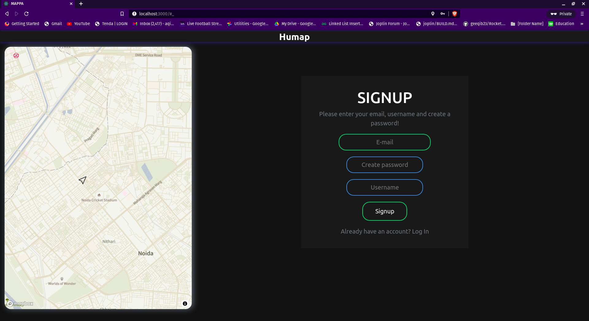
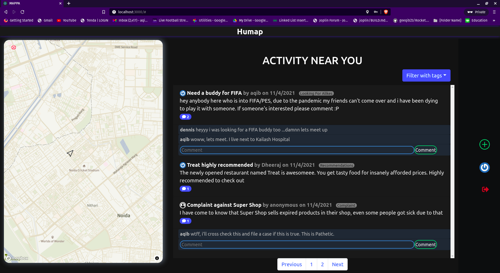
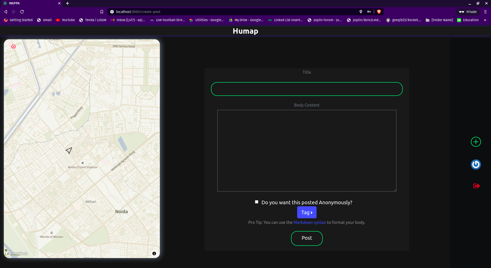

# COMMUNITY CANVAS

Community Canvas is a web app which aims to digitalize how societies interact within themselves by providing an easy interface to communicate which can result in creating better versions of themselves.

## Why I Built This
Back in the days, society used to be tighly linked and knew everything about each other, they used to communicate very well with each other and this made societies
capable of solving many issues effeciently. Nowadays, despite the increase in the number of issues persisting in society, society has grown apart and after the pandemic of 2020, it seems as if even neighbours are even more separated.

That's why we made this app, to help societies be together closely despite all the distance between us right now and to help societies work on improving themselves by openly talking about issues and coming up with solutions.

## Working
We allow the user to make posts along with a tag from his/her/their location and this post along with each post is saved along with the location in MongoDB Atlas DB.
The user can also view posts in an area (within 2kms of the location pointed by the user) by using the interactive map and pointing to which location's post he/she/they want to see.

## Demo

## Technologies Used
1. MongoDB along with Mongoose
2. ExpressJS
3. React
4. NodeJS
5. Bootstrap
6. Mapbox API

## Challenges I Faced
1. Finding a map api which was free and which worked well with React was quite a tough task
2. Git Workflow
3. Mapbox isn't the best when it comes to map APIs and its react wrapper is even worse

